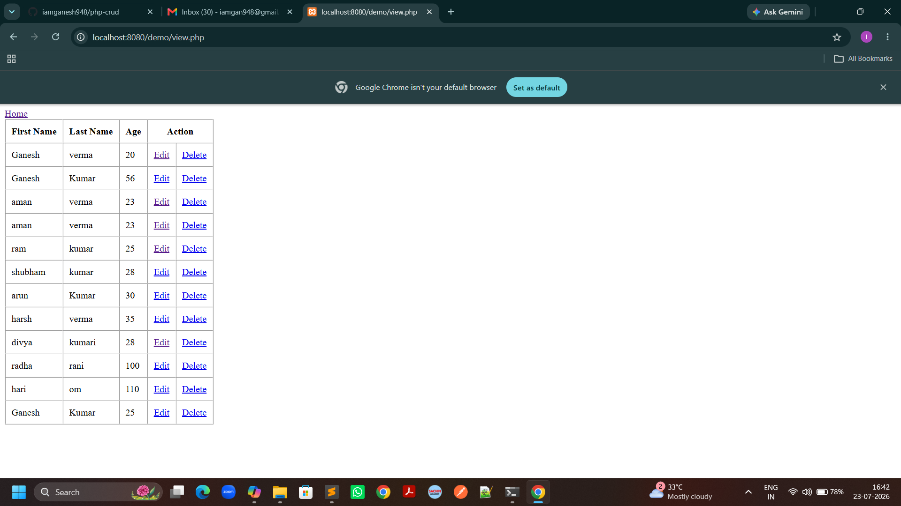
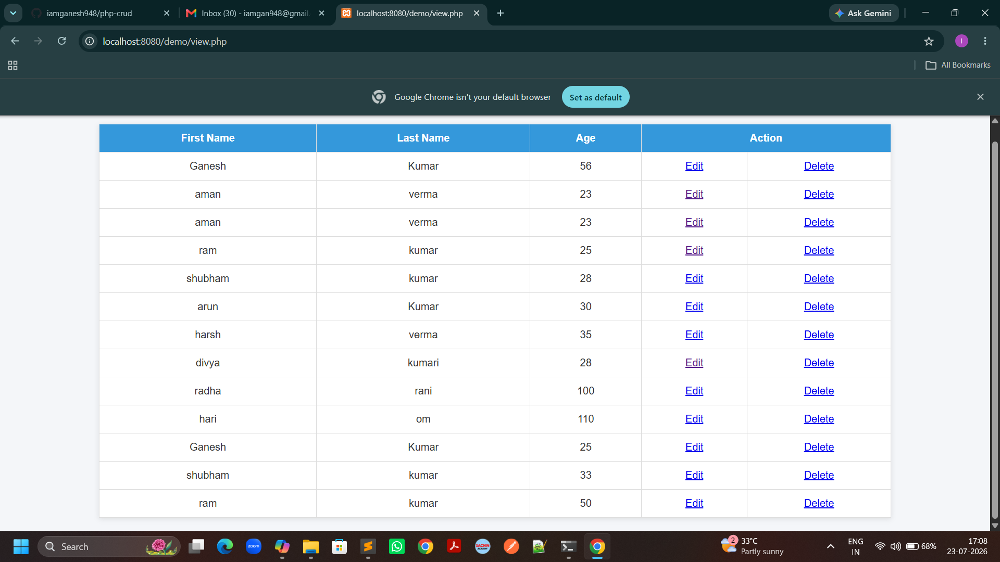
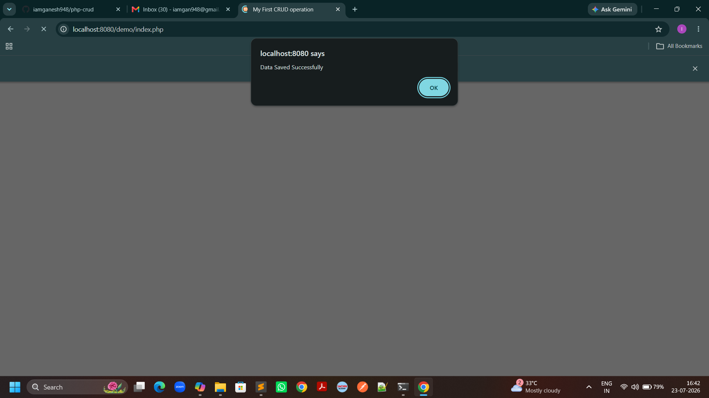
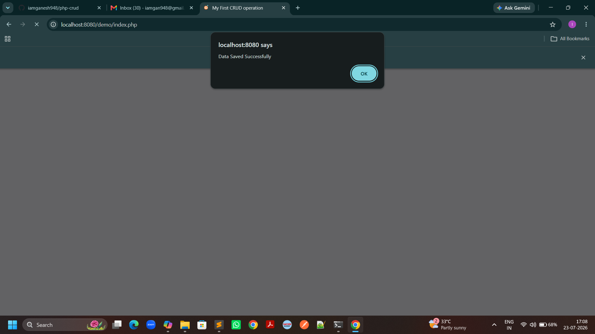
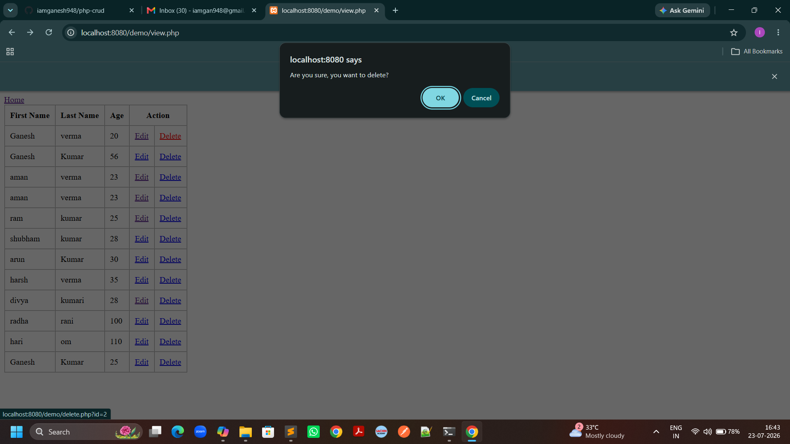
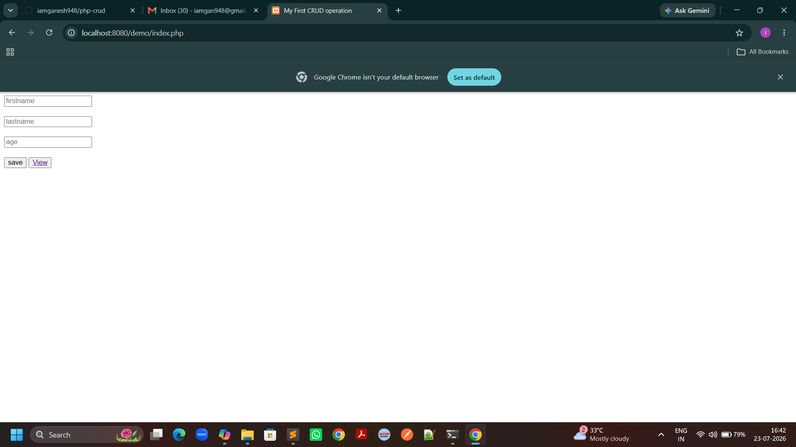
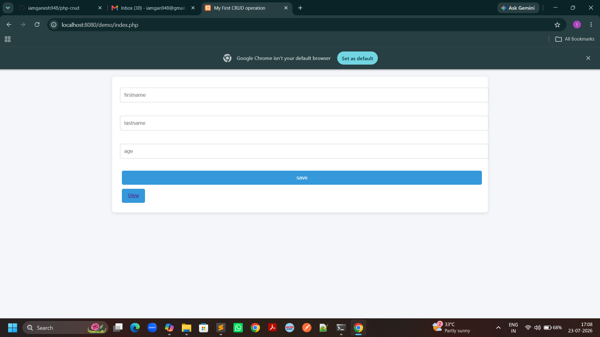

# PHP CRUD Application

A simple **Create, Read, Update, Delete (CRUD)** application built with PHP and MySQL.  
This project demonstrates basic database operations and serves as a foundation for learning web development.

## 🚀 Features
- Create new records
- View existing records
- Update records
- Delete records
- Clean and simple UI

## 🛠️ Technologies Used
- PHP
- MySQL (via XAMPP)
- HTML, CSS
- Bootstrap (optional for styling)

## ⚙️ Setup Instructions
1. Clone the repository:
   ```bash
   git clone https://github.com/iamganesh948/php-crud.git

## 📸 Screenshots

### Homepage


### Homepage


### Add Record Form


### Add Record Form


### Delete Record Form


### View Records


### View Record Form


### View Records
